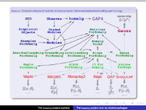

<!-- BEGIN HEADER -->
# homalg project&ensp;[![View code][code-img]][code-url]

### The packages of the homalg project

| Build Status | Code Coverage |
| ------------ | ------------- |
| [![Build Status][tests-img]][tests-url] | [![Code Coverage][codecov-img]][codecov-url] |

<!-- END HEADER -->

The homalg project is a multi-author multi-package open source software project for constructive homological algebra.

Mainly written in GAP4 it allows the use of external programs and other computer algebra systems (CASs) for specific time critical tasks.
Although the central part of the source code is the formalization of abstract notions like Abelian categories, our focus lies on concrete applications ranging from linear control theory to commutative algebra and algebraic geometry.

A big part of the project is already distributed with [GAP](https://www.gap-system.org/). The yet undeposited packages and the tested development versions of all packages can be downloaded from the project GitHub homepage.

The core part of the project is the [homalg package](homalg#readme). It provides an abstract structure and algorithms for abelian categories up to spectral sequences of multigraded complexes.

The [other packages](#packages-of-homalg_project) of the homalg project implement data structures and algorithms for several mathematical objects, like modules over graded rings. For more packages based on the homalg project see the table on [this page](https://homalg-project.github.io/docs/homalg_project-based/).

This [slideshow](https://github.com/homalg-project/homalg_project/raw/master/images/homalg-project.pdf) visualizes the interdependency of most of the packages in this repository:

<!-- BEGIN FOOTER -->
### Packages of [homalg_project](/../../):
| Name | Description | Documentation |
| ---- | ----------- | ------------- |
| [homalg](homalg#readme) | A homological algebra meta-package for computable Abelian categories | [![HTML stable documentation][html-homalg-img]][html-homalg-url] [![PDF stable documentation][pdf-homalg-img]][pdf-homalg-url] |
| [4ti2Interface](4ti2Interface#readme) | A link to 4ti2 | [![HTML stable documentation][html-4ti2Interface-img]][html-4ti2Interface-url] [![PDF stable documentation][pdf-4ti2Interface-img]][pdf-4ti2Interface-url] |
| [ExamplesForHomalg](ExamplesForHomalg#readme) | Examples for the GAP Package homalg | [![HTML stable documentation][html-ExamplesForHomalg-img]][html-ExamplesForHomalg-url] [![PDF stable documentation][pdf-ExamplesForHomalg-img]][pdf-ExamplesForHomalg-url] |
| [Gauss](Gauss#readme) | Extended Gauss functionality for GAP | [![HTML stable documentation][html-Gauss-img]][html-Gauss-url] [![PDF stable documentation][pdf-Gauss-img]][pdf-Gauss-url] |
| [GaussForHomalg](GaussForHomalg#readme) | Gauss functionality for the homalg project | [![HTML stable documentation][html-GaussForHomalg-img]][html-GaussForHomalg-url] [![PDF stable documentation][pdf-GaussForHomalg-img]][pdf-GaussForHomalg-url] |
| [GradedModules](GradedModules#readme) | A homalg based package for the Abelian category of finitely presented graded modules over computable graded rings | [![HTML stable documentation][html-GradedModules-img]][html-GradedModules-url] [![PDF stable documentation][pdf-GradedModules-img]][pdf-GradedModules-url] |
| [GradedRingForHomalg](GradedRingForHomalg#readme) | Endow Commutative Rings with an Abelian Grading | [![HTML stable documentation][html-GradedRingForHomalg-img]][html-GradedRingForHomalg-url] [![PDF stable documentation][pdf-GradedRingForHomalg-img]][pdf-GradedRingForHomalg-url] |
| [HomalgToCAS](HomalgToCAS#readme) | A window to the outer world | [![HTML stable documentation][html-HomalgToCAS-img]][html-HomalgToCAS-url] [![PDF stable documentation][pdf-HomalgToCAS-img]][pdf-HomalgToCAS-url] |
| [IO_ForHomalg](IO_ForHomalg#readme) | IO capabilities for the homalg project | [![HTML stable documentation][html-IO_ForHomalg-img]][html-IO_ForHomalg-url] [![PDF stable documentation][pdf-IO_ForHomalg-img]][pdf-IO_ForHomalg-url] |
| [LocalizeRingForHomalg](LocalizeRingForHomalg#readme) | A Package for Localization of Polynomial Rings | [![HTML stable documentation][html-LocalizeRingForHomalg-img]][html-LocalizeRingForHomalg-url] [![PDF stable documentation][pdf-LocalizeRingForHomalg-img]][pdf-LocalizeRingForHomalg-url] |
| [MatricesForHomalg](MatricesForHomalg#readme) | Matrices for the homalg project | [![HTML stable documentation][html-MatricesForHomalg-img]][html-MatricesForHomalg-url] [![PDF stable documentation][pdf-MatricesForHomalg-img]][pdf-MatricesForHomalg-url] |
| [Modules](Modules#readme) | A homalg based package for the Abelian category of finitely presented modules over computable rings | [![HTML stable documentation][html-Modules-img]][html-Modules-url] [![PDF stable documentation][pdf-Modules-img]][pdf-Modules-url] |
| [RingsForHomalg](RingsForHomalg#readme) | Dictionaries of external rings | [![HTML stable documentation][html-RingsForHomalg-img]][html-RingsForHomalg-url] [![PDF stable documentation][pdf-RingsForHomalg-img]][pdf-RingsForHomalg-url] |
| [SCO](SCO#readme) | SCO - Simplicial Cohomology of Orbifolds | [![HTML stable documentation][html-SCO-img]][html-SCO-url] [![PDF stable documentation][pdf-SCO-img]][pdf-SCO-url] |
| [ToolsForHomalg](ToolsForHomalg#readme) | Special methods and knowledge propagation tools | [![HTML stable documentation][html-ToolsForHomalg-img]][html-ToolsForHomalg-url] [![PDF stable documentation][pdf-ToolsForHomalg-img]][pdf-ToolsForHomalg-url] |

[html-homalg-img]: https://img.shields.io/badge/🔗%20HTML-stable-blue.svg
[html-homalg-url]: https://homalg-project.github.io/homalg_project/homalg/doc/chap0_mj.html

[pdf-homalg-img]: https://img.shields.io/badge/🔗%20PDF-stable-blue.svg
[pdf-homalg-url]: https://homalg-project.github.io/homalg_project/homalg/download_pdf.html

[html-4ti2Interface-img]: https://img.shields.io/badge/🔗%20HTML-stable-blue.svg
[html-4ti2Interface-url]: https://homalg-project.github.io/homalg_project/4ti2Interface/doc/chap0_mj.html

[pdf-4ti2Interface-img]: https://img.shields.io/badge/🔗%20PDF-stable-blue.svg
[pdf-4ti2Interface-url]: https://homalg-project.github.io/homalg_project/4ti2Interface/download_pdf.html

[html-ExamplesForHomalg-img]: https://img.shields.io/badge/🔗%20HTML-stable-blue.svg
[html-ExamplesForHomalg-url]: https://homalg-project.github.io/homalg_project/ExamplesForHomalg/doc/chap0_mj.html

[pdf-ExamplesForHomalg-img]: https://img.shields.io/badge/🔗%20PDF-stable-blue.svg
[pdf-ExamplesForHomalg-url]: https://homalg-project.github.io/homalg_project/ExamplesForHomalg/download_pdf.html

[html-Gauss-img]: https://img.shields.io/badge/🔗%20HTML-stable-blue.svg
[html-Gauss-url]: https://homalg-project.github.io/homalg_project/Gauss/doc/chap0_mj.html

[pdf-Gauss-img]: https://img.shields.io/badge/🔗%20PDF-stable-blue.svg
[pdf-Gauss-url]: https://homalg-project.github.io/homalg_project/Gauss/download_pdf.html

[html-GaussForHomalg-img]: https://img.shields.io/badge/🔗%20HTML-stable-blue.svg
[html-GaussForHomalg-url]: https://homalg-project.github.io/homalg_project/GaussForHomalg/doc/chap0_mj.html

[pdf-GaussForHomalg-img]: https://img.shields.io/badge/🔗%20PDF-stable-blue.svg
[pdf-GaussForHomalg-url]: https://homalg-project.github.io/homalg_project/GaussForHomalg/download_pdf.html

[html-GradedModules-img]: https://img.shields.io/badge/🔗%20HTML-stable-blue.svg
[html-GradedModules-url]: https://homalg-project.github.io/homalg_project/GradedModules/doc/chap0_mj.html

[pdf-GradedModules-img]: https://img.shields.io/badge/🔗%20PDF-stable-blue.svg
[pdf-GradedModules-url]: https://homalg-project.github.io/homalg_project/GradedModules/download_pdf.html

[html-GradedRingForHomalg-img]: https://img.shields.io/badge/🔗%20HTML-stable-blue.svg
[html-GradedRingForHomalg-url]: https://homalg-project.github.io/homalg_project/GradedRingForHomalg/doc/chap0_mj.html

[pdf-GradedRingForHomalg-img]: https://img.shields.io/badge/🔗%20PDF-stable-blue.svg
[pdf-GradedRingForHomalg-url]: https://homalg-project.github.io/homalg_project/GradedRingForHomalg/download_pdf.html

[html-HomalgToCAS-img]: https://img.shields.io/badge/🔗%20HTML-stable-blue.svg
[html-HomalgToCAS-url]: https://homalg-project.github.io/homalg_project/HomalgToCAS/doc/chap0_mj.html

[pdf-HomalgToCAS-img]: https://img.shields.io/badge/🔗%20PDF-stable-blue.svg
[pdf-HomalgToCAS-url]: https://homalg-project.github.io/homalg_project/HomalgToCAS/download_pdf.html

[html-IO_ForHomalg-img]: https://img.shields.io/badge/🔗%20HTML-stable-blue.svg
[html-IO_ForHomalg-url]: https://homalg-project.github.io/homalg_project/IO_ForHomalg/doc/chap0_mj.html

[pdf-IO_ForHomalg-img]: https://img.shields.io/badge/🔗%20PDF-stable-blue.svg
[pdf-IO_ForHomalg-url]: https://homalg-project.github.io/homalg_project/IO_ForHomalg/download_pdf.html

[html-LocalizeRingForHomalg-img]: https://img.shields.io/badge/🔗%20HTML-stable-blue.svg
[html-LocalizeRingForHomalg-url]: https://homalg-project.github.io/homalg_project/LocalizeRingForHomalg/doc/chap0_mj.html

[pdf-LocalizeRingForHomalg-img]: https://img.shields.io/badge/🔗%20PDF-stable-blue.svg
[pdf-LocalizeRingForHomalg-url]: https://homalg-project.github.io/homalg_project/LocalizeRingForHomalg/download_pdf.html

[html-MatricesForHomalg-img]: https://img.shields.io/badge/🔗%20HTML-stable-blue.svg
[html-MatricesForHomalg-url]: https://homalg-project.github.io/homalg_project/MatricesForHomalg/doc/chap0_mj.html

[pdf-MatricesForHomalg-img]: https://img.shields.io/badge/🔗%20PDF-stable-blue.svg
[pdf-MatricesForHomalg-url]: https://homalg-project.github.io/homalg_project/MatricesForHomalg/download_pdf.html

[html-Modules-img]: https://img.shields.io/badge/🔗%20HTML-stable-blue.svg
[html-Modules-url]: https://homalg-project.github.io/homalg_project/Modules/doc/chap0_mj.html

[pdf-Modules-img]: https://img.shields.io/badge/🔗%20PDF-stable-blue.svg
[pdf-Modules-url]: https://homalg-project.github.io/homalg_project/Modules/download_pdf.html

[html-RingsForHomalg-img]: https://img.shields.io/badge/🔗%20HTML-stable-blue.svg
[html-RingsForHomalg-url]: https://homalg-project.github.io/homalg_project/RingsForHomalg/doc/chap0_mj.html

[pdf-RingsForHomalg-img]: https://img.shields.io/badge/🔗%20PDF-stable-blue.svg
[pdf-RingsForHomalg-url]: https://homalg-project.github.io/homalg_project/RingsForHomalg/download_pdf.html

[html-SCO-img]: https://img.shields.io/badge/🔗%20HTML-stable-blue.svg
[html-SCO-url]: https://homalg-project.github.io/homalg_project/SCO/doc/chap0_mj.html

[pdf-SCO-img]: https://img.shields.io/badge/🔗%20PDF-stable-blue.svg
[pdf-SCO-url]: https://homalg-project.github.io/homalg_project/SCO/download_pdf.html

[html-ToolsForHomalg-img]: https://img.shields.io/badge/🔗%20HTML-stable-blue.svg
[html-ToolsForHomalg-url]: https://homalg-project.github.io/homalg_project/ToolsForHomalg/doc/chap0_mj.html

[pdf-ToolsForHomalg-img]: https://img.shields.io/badge/🔗%20PDF-stable-blue.svg
[pdf-ToolsForHomalg-url]: https://homalg-project.github.io/homalg_project/ToolsForHomalg/download_pdf.html

[tests-img]: https://github.com/homalg-project/homalg_project/actions/workflows/Tests.yml/badge.svg?branch=master
[tests-url]: https://github.com/homalg-project/homalg_project/actions/workflows/Tests.yml?query=branch%3Amaster

[codecov-img]: https://codecov.io/gh/homalg-project/homalg_project/branch/master/graph/badge.svg
[codecov-url]: https://app.codecov.io/gh/homalg-project/homalg_project

[code-img]: https://img.shields.io/badge/-View%20code-blue?logo=github
[code-url]: https://github.com/homalg-project/homalg_project#top
<!-- END FOOTER -->
